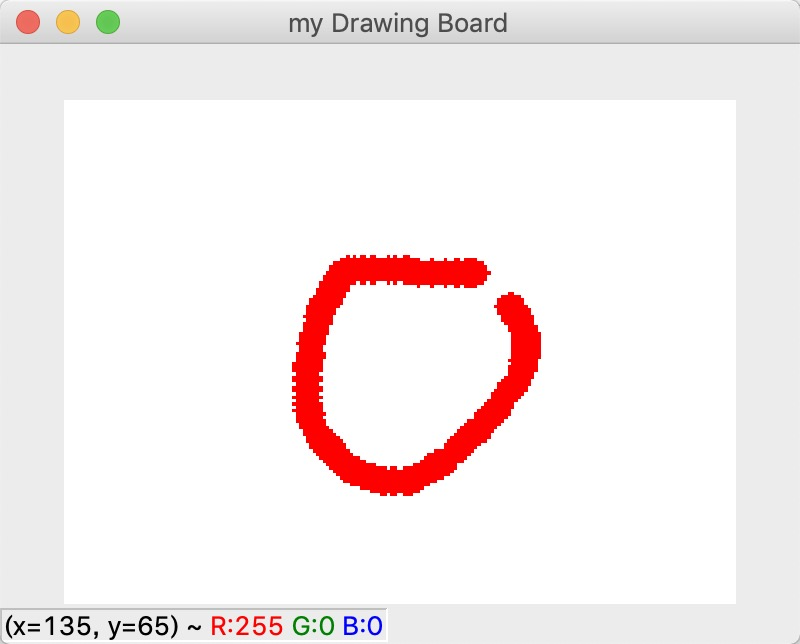

# Paint-Bucket-with-Gap

Implement paint bucket tool in photoshop(or FloodFill algorithm) which can automatically ignore small gaps.

## Usage
```python
# You can change parameters in simplePainter.py according to your requirement
python simplePainter.py
```

## Drawing and FloodFill Result
1. First, press 'b' to enter brush mode, then click left mouse button and move it to draw something with small gap(like the pic below).
(also, you can press 'e' to erase your drawing, or '-/+' to change your brush size)
<p align="center">
  
</p>
2. Second, press 's' to enter seed mode, then click left mouse button in the appropriate area(for example, in the circle with gap).
The floodfill result will be automatically saved according to your specified save path.
**Result**
<p align="center">
  
</p>

**Reference:**  
[1] https://github.com/alkasm/magicwand   
[2] https://github.com/sketchglass/floodfill-experiment  
[3] https://blog.csdn.net/qq_42191914/article/details/105035921  
[4] https://github.com/aapsi/Paint-Application
